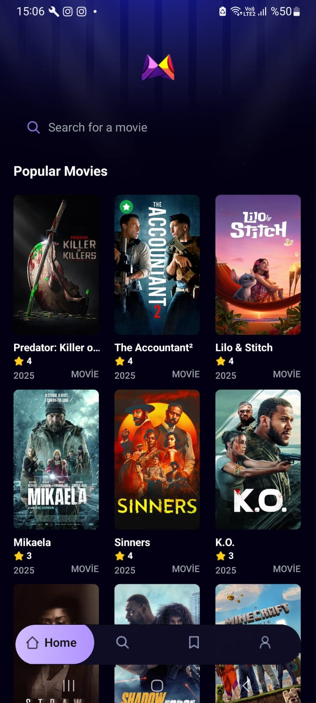

# 🎬 MovieApp - Movie Discovery & Watchlist

A beautiful, modern movie discovery app built with React Native and Expo. Browse popular movies, search for your favorites, and build your personal watchlist with a sleek, dark-themed interface.



## ✨ Features

### 🏠 **Home Screen**
- Browse popular movies with stunning poster displays
- Quick search access with auto-focus navigation
- Beautiful background imagery and smooth animations
- Grid layout with movie ratings and release years

### 🔍 **Search Functionality**
- Real-time search with 500ms debounce for optimal performance
- Search history and popular search suggestions
- Auto-focus when navigating from home screen
- Comprehensive search results with movie details

### 📱 **Movie Details**
- Comprehensive movie information including:
  - High-resolution backdrop and poster images
  - Movie ratings, runtime, and release dates
  - Director, cast, and crew information
  - Budget and production details
  - Full plot overview
- Horizontal scrolling cast section with photos
- Graceful handling of missing images and data
- Professional fallback placeholders

### 💾 **Watchlist Management**
- Save movies to personal watchlist
- Remove movies with confirmation dialogs
- Persistent storage using AsyncStorage
- Green indicators on saved movies across all screens
- Single-column layout for easy browsing
- Pull-to-refresh functionality

### 👤 **Profile & Settings**
- User profile with watchlist statistics
- Average rating calculations
- Clear watchlist functionality
- App information and feedback options
- Direct navigation to saved movies

### 🎨 **Design & UX**
- Dark theme with purple accent colors (`#AB8BFF`)
- Consistent background imagery across all screens
- Professional loading states and error handling
- Smooth navigation with expo-router
- Responsive design for different screen sizes
- Tab-based navigation with custom styling

## 🛠 Tech Stack

### **Frontend Framework**
- **React Native** - Cross-platform mobile development
- **Expo SDK 53** - Development platform and tools
- **TypeScript** - Type-safe JavaScript

### **Navigation**
- **Expo Router** - File-based routing system
- **React Navigation** - Tab and stack navigation

### **Styling**
- **NativeWind** - Tailwind CSS for React Native
- **Custom Color Scheme** - Dark theme with purple accents

### **State Management**
- **React Hooks** - useState, useEffect, useCallback
- **Custom Hooks** - useFetch, useSavedMovies

### **Data & Storage**
- **AsyncStorage** - Persistent local storage
- **TMDB API** - The Movie Database for movie data

### **Development Tools**
- **Expo CLI** - Development and build tools
- **TypeScript** - Static type checking
- **ESLint** - Code linting and formatting

## 🚀 Getting Started

### **Prerequisites**
- Node.js (v16 or higher)
- npm or yarn
- Expo CLI
- iOS Simulator or Android Emulator (optional)
- Expo Go app on your mobile device

### **Installation**

1. **Clone the repository**
   ```bash
   git clone https://github.com/yourusername/movieapp.git
   cd movieapp
   ```

2. **Install dependencies**
   ```bash
   npm install --legacy-peer-deps
   ```

3. **Set up environment variables**
   Create a `.env` file in the root directory:
   ```env
   EXPO_PUBLIC_MOVIE_API_KEY=your_tmdb_api_key_here
   ```

4. **Get TMDB API Key**
   - Visit [The Movie Database](https://www.themoviedb.org/)
   - Create a free account
   - Go to Settings > API
   - Copy your API key

5. **Start the development server**
   ```bash
   npm start
   ```

6. **Run on device/simulator**
   - Scan QR code with Expo Go app (mobile)
   - Press `i` for iOS simulator
   - Press `a` for Android emulator

## 📁 Project Structure

```
movieapp/
├── app/                    # App screens and navigation
│   ├── (tabs)/            # Tab-based screens
│   │   ├── index.tsx      # Home screen
│   │   ├── search.tsx     # Search screen
│   │   ├── saved.tsx      # Saved movies screen
│   │   └── profile.tsx    # Profile screen
│   ├── movies/            # Movie detail screens
│   │   └── [id].tsx       # Dynamic movie detail page
│   └── _layout.tsx        # Root layout
├── components/            # Reusable components
│   ├── MovieCard.tsx      # Movie display card
│   ├── SavedMovieCard.tsx # Saved movie card
│   └── SearchBar.tsx      # Search input component
├── services/              # API and data services
│   ├── api.ts             # TMDB API functions
│   ├── useFetch.ts        # Custom fetch hook
│   ├── savedMovies.ts     # AsyncStorage operations
│   └── useSavedMovies.ts  # Saved movies hook
├── constants/             # App constants
│   ├── icons.ts           # Icon imports
│   ├── images.ts          # Image imports
│   └── Colors.ts          # Color definitions
├── assets/                # Static assets
│   ├── icons/             # App icons
│   └── images/            # Background images
└── types/                 # TypeScript type definitions
```

## 🎨 Color Scheme

```typescript
const Colors = {
  primary: '#030014',      // Deep dark background
  accent: '#AB8BFF',       // Purple accent
  'dark-200': '#1a1a1a',   // Dark gray
  'light-200': '#e5e5e5',  // Light gray
  'light-300': '#d1d5db',  // Medium light gray
}
```

## 📱 API Integration

### **TMDB API Endpoints Used**
- **Popular Movies**: `/movie/popular`
- **Search Movies**: `/search/movie`
- **Movie Details**: `/movie/{id}`
- **Movie Credits**: `/movie/{id}/credits`

### **Image URLs**
- **Posters**: `https://image.tmdb.org/t/p/w500{poster_path}`
- **Backdrops**: `https://image.tmdb.org/t/p/w780{backdrop_path}`
- **Profiles**: `https://image.tmdb.org/t/p/w185{profile_path}`

## 🔧 Configuration

### **App Configuration (app.json)**
```json
{
  "expo": {
    "name": "MovieApp",
    "slug": "movieapp",
    "version": "1.0.0",
    "platforms": ["ios", "android"],
    "newArchEnabled": false,
    "androidNavigationBar": {
      "backgroundColor": "transparent"
    }
  }
}
```

### **NativeWind Configuration (tailwind.config.js)**
```javascript
module.exports = {
  content: ["./app/**/*.{js,jsx,ts,tsx}", "./components/**/*.{js,jsx,ts,tsx}"],
  theme: {
    extend: {
      colors: {
        primary: '#030014',
        accent: '#AB8BFF',
        // ... other colors
      }
    }
  }
}
```

## 🚀 Building for Production

### **iOS Build**
```bash
expo build:ios
```

### **Android Build**
```bash
expo build:android
```

### **EAS Build (Recommended)**
```bash
npm install -g @expo/eas-cli
eas build --platform all
```

## 🧪 Testing

### **Run Tests**
```bash
npm test
```

### **Type Checking**
```bash
npx tsc --noEmit
```

## 📝 Known Issues & Solutions

### **TurboModule Error**
If you encounter TurboModule errors:
- Ensure `"newArchEnabled": false` in app.json
- Use `--legacy-peer-deps` flag when installing packages

### **Image Loading Issues**
- Check internet connection
- Verify TMDB API key is correct
- Fallback placeholders are implemented for missing images

## 🤝 Contributing

1. Fork the repository
2. Create a feature branch (`git checkout -b feature/amazing-feature`)
3. Commit your changes (`git commit -m 'Add amazing feature'`)
4. Push to the branch (`git push origin feature/amazing-feature`)
5. Open a Pull Request

## 📄 License

This project is licensed under the MIT License - see the [LICENSE](LICENSE) file for details.

## 🙏 Acknowledgments

- **The Movie Database (TMDB)** - For providing the movie data API
- **Expo Team** - For the amazing development platform
- **React Native Community** - For the robust mobile framework
- **NativeWind** - For bringing Tailwind CSS to React Native


